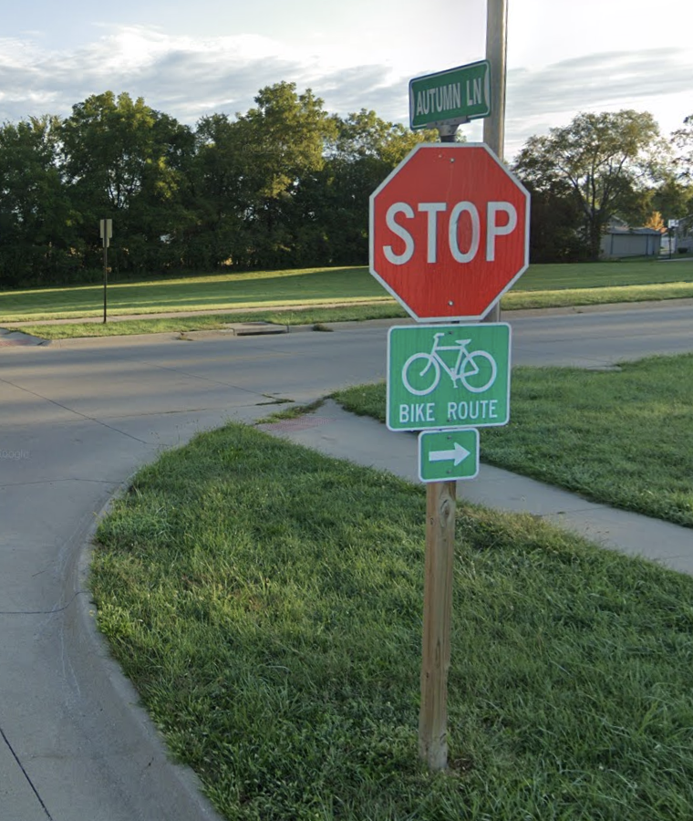
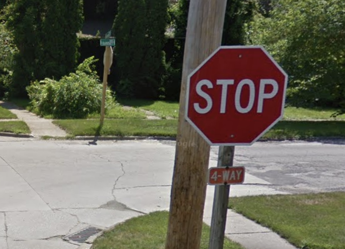
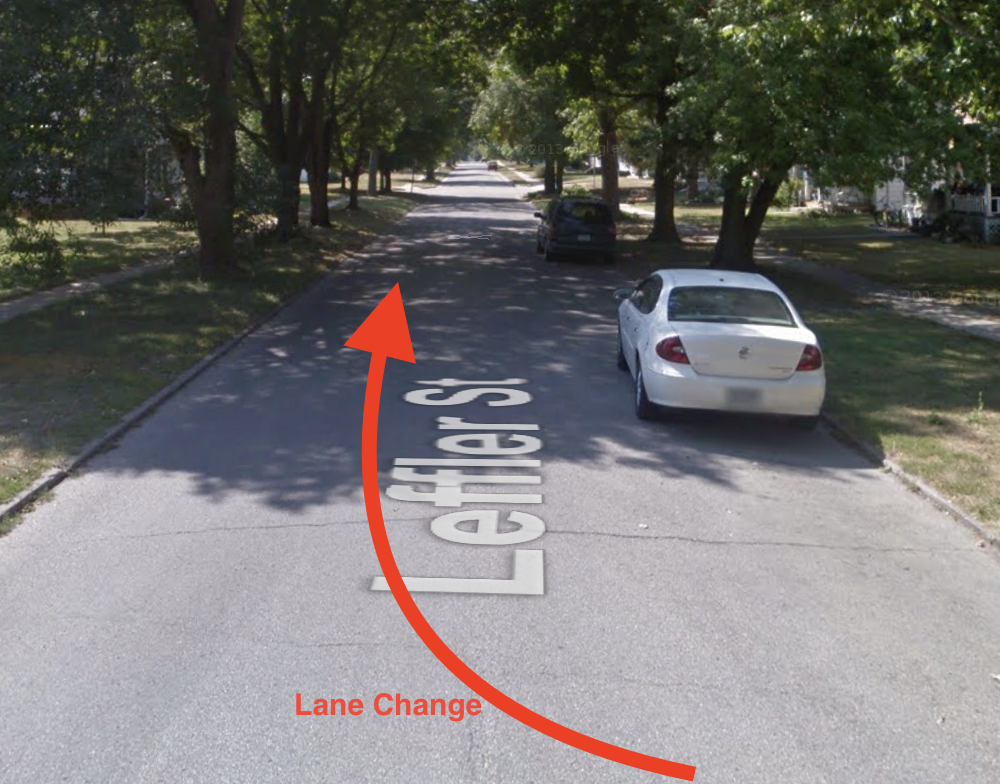
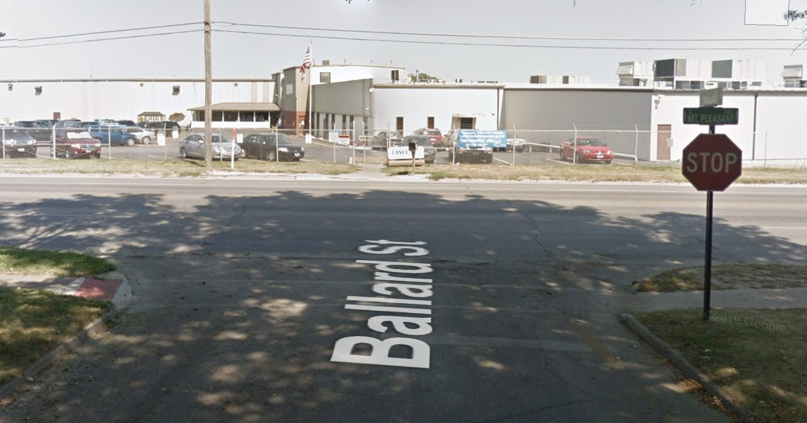
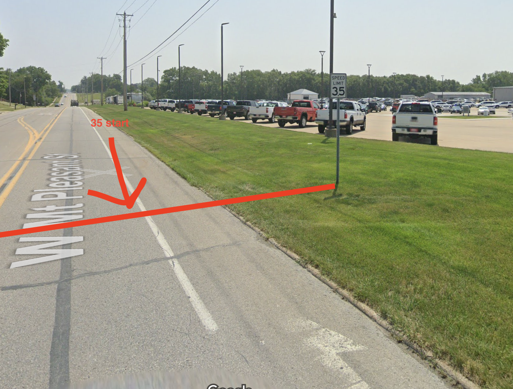

# Driving License

ယာဉ်မောင်းလိုင်စင်အတွက် ၂ဆင့် ဖြေဆိုရမည်ဖြစ်ပြီး knowledge test and driving test ဟူ၍ ရှိသည်။

Knowledge test အတွက် လိုအပ်ချက်များမှာ

- I20
- [I94](https://i94.cbp.dhs.gov/I94/#/recent-search)
- Passport
- မိမိတင်ပြသော လိပ်စာတွင် နေထိုင်ကြောင်း သက်သေ(ကျောင်းမှ housing@miu.edu email ကို တောင်းနိုင်သည် သို့မဟုတ် ဘဏ်မှ agreement form ကို ယူဆောင် သွားနိုင်သည်)
- I20 start date နောက်ပိုင်းမှသာ ဖြေဆိုနိုင်သည်၊ Program မစတင်ခင် စော၍ ရောက်ရှိပြီး ဖြေဆိုမည်ဆိုပါက ဖြေဆိုနိုင်သော်လည်း I20 start date ရောက်လျှင် document များကို processing ပြန် လုပ်ဆောင်ရမည် ဖြစ်သောကြောင့် အချိန် ကြာမြင့်နိုင်ပါသည်။

အောင်လျှင် $6 ပေးသွင်းရမည်။

# FAIRFIELD မြို့အတွက် Knowledge test only appointment ယူရန်

[https://www.picktime.com/JeffersonCountyDL](https://www.picktime.com/JeffersonCountyDL)

သို့မဟုတ်

[Sigourney](https://www.google.com/maps/place/Keokuk+Motor+Vehicle+Department/@41.3333362,-92.2051183,166m/data=!3m1!1e3!4m6!3m5!1s0x87e5e149c047a80d:0x8afffc90233bee42!8m2!3d41.3332432!4d-92.2045644!16s%2Fg%2F1tcwrpr5) သိို့ သွားပြီး ဖြေနိုင်သည်။ ၁ နာရီ မှ ၄ နာရီ အတွင်း appointment မယူပဲ သွားကာ ဖြေနိုင်သည်။

## Knowledge test စာမေးပွဲအတွက် ကြည့်ရန် စာ

- [Iowa-Driver-License-Test-4.pdf](Iowa-Driver-License-Test-4.pdf)

## Knowledge test စာမေးပွဲအတွက် လေ့ကျင့်ဖြေဆိုရန်

[https://iowadot.gov/mvd/driverslicense/iadrivertest_desktop.aspx](https://iowadot.gov/mvd/driverslicense/iadrivertest_desktop.aspx)

## Driving test အတွက် လိုအပ်ချက်များမှာ

Behind the wheel / Driving test အတွက် လိုအပ်ချက်များမှာ

- SSN number (ကျောင်းမှ လျှောက်ပေးမည်)
- I20
- I94
- မိမိတင်ပြသော လိပ်စာတွင် နေထိုင်ကြောင်း သက်သေ(ကျောင်းမှ housing@miu.edu email ကို တောင်းနိုင်သည် သို့မဟုတ် ဘဏ်မှ agreement form ကို ယူဆောင် သွားနိုင်သည်)
- Passport
- ကား , The vehicle must pass an inspection. Your vehicle must have the following working headlights, brake lights & turn signals, horn, tires, exhaust (no leaks) and mirrors, front driver and passenger windows must roll down, the windows/windshield must permit clear vision (no cracks the impede your or the Drive Examiner’s line of sight or that intersect with another crack) and no spiderweb cracks in the windshield area that is swept by the windshield wipers, license plate on front and back of the vehicle, and both driver and passenger doors must be able to open from the interior.
- ကားနှင့်အတူ insurance ပေးသွင်းထားသော စာရွက်စာတမ်း

အောင်လျှင် $8 ပေးသွင်းရမည်။

Knowledge test အောင်မြင်ပြီး ကဒ်ရရှိမှ Driving test အတွက် appointment ယူနိုင်သည်၊ စာရွက်နှင့် appointment ယူ၍ မရပါ။

Driving test ဖြေဆိုပြီး ကျလျှင် Appintment ပြန်ယူပြီး ဖြေဆိုင်နိုင်ပါသည်။ ပုံမှန် ၁ ပတ် စောင့်ဆိုင်းပြီးမှသာ appointment ပြန် ယူနိုင်သည်။

## FAIRFIELD မြို့တွင် Driving test(Behind the wheel) Appointment ယူရန်

ကျောင်းနားရှိ Jefferson County တွင် appointment ယူမည်ဆိုပါက လတိုင်း၏ နောက်ဆုံးအပတ် တနင်္လာနေ့တွင် Knowledge test ဖြေခဲ့သော နေရာတွင် လူကိုယ်တိုင် သွားရောက် ယူရမည် ဖြစ်သည် (သို့မဟုတ်) ဖုန်းဆက်ကာ ယူနိုင်သည်။ (လူများသည့်အတွက်ကြောင့် မနက် ၃/၄နာရီ သွားစောင့်ကြသည်၊ winter break, summer break များတွင်တော့ သက်တောင့်သက်သာ ရနိုင်သည်)။

641 472 2349 / 51 W. Briggs Ave

## FAIRFIELD မဟုတ်သော အခြားမြို့များတွင် Driving test(Behind the wheel) Appointment ယူရန်

[Appointment](https://smsqmatic.iowadot.gov/qmaticwebbooking/index.html) ယူရာတွင် ၂မျိုးရှိပြီး ပေးထားသော link မှာ ကျောင်းနှင့်အနီးရှိ မြို့များတွင် appointment booking တင်ရန်ဖြစ်ပါသည်။

## Route

### Fairfield

### Otumwa

### Burlington

## သတိထားသင့်သည့် အချက်များ

အမှတ် သည် အမှား တွေ ပေါ်မူတည်ပြီး တိုးတိုး ပေးသွားခြင်းဖြစ်သည်။ 35 မှတ် အောက် ရောက် ပါက အောင် မည် ဖြစ်သည်။ 35 မှတ် ထက် ကျော်ပါက ကျ မည် ဖြစ် သည်။ အမှား သေးသေးလေး များ များသွားပါက ကျနိုင်သည်။

### Stop

Stop Sign တွေ့လျှင် ရပ်ပါ။​ ၃ စက္ကန့် ခန့် စောင့်ပါ။ မထွက်ခင် ဘယ်ကြည့် ညာကြည့် ကြည့်ပြီးမှ ထွက်ပါ။

ကိုယ့် ရှေ့မှ ကား Stop မှ ထွက်သွားလျှင် ကိုယ့် ကား သည် Stop တွင် ထပ် စောင့် ရမည် ဖြစ်သည်။

### Stop All

Stop All သို့မဟုတ် 4-Way ဆိုရင် လမ်းစုံတွေ ကား အားလုံး ရပ်မည်။ အရင် ရောက်သည့် ကား အရင် ထွက်ရမည်။

ကိုယ့်ထက် အရင် ရောက်သည့် ကားကို ဦးစားပေးပြီးမှ ထွက်ရမည်။

ကိုယ့် ရှေ့မှ ကား Stop မှ ထွက်သွားလျှင် ကိုယ့် ကား သည် Stop တွင် ထပ် စောင့် ရမည် ဖြစ်သည်။ ကိုယ့် ထက် ဦးစွာ ရောက်သည့် ကား ထွက် ပြီး မှ ထွက်ရမည်။

### လမ်းဆုံ ဘယ် ညာ ကြည့်

လမ်း ဆုံ တွင် အရှိန် နည်းနည်း လျော့ကာ ဘယ် ကြည့် ညာ ကြည့် ကြည့် ရမည်။ မကြည့်လျှင် အမှတ်တိုး နိုင်သည်။

### လမ်းကျဥ်း ကား ရပ် Lane Change

ညာဘက် အခြမ်းတွေ ကား ရပ် ထားပါက ဘယ် ဘက် Lane ကို ယူ လိုက်ပါ။ ကား နား ကပ် ပြီး မသွားပါနှင့်။ အပြည့် အဝ Lane change လိုက်ပါ။ ရပ် ထားသည့် ကားသည် တံခါး ဖွင့် နိုင်သောကြောင့် ဖြစ်သည်။

### 90 Degree Turn

လမ်းမ ကြီး ထွက်သည့် အခါမှာ 45 deg မျော မယူပဲ 90 degree turn လုပ်ရန် လိုအပ်သည်။

### တစ်ဖက် လမ်း ကွေ့ ခေါင်း နောက်လှည့်

Central Lane ထဲ မဝင် ခင်မှာ

- အချက်ပြ
- ခေါင်းဖြည့် နောက်လှည့် ကြည့် လုပ်ရန်

လိုအပ်သည်။

### ကပ် မလိုက် နှင့်

ရှေ့ ကား နှင့် ကပ် ပြီး မလိုက် ပါ နှင့်။​ ခပ်ခွာခွာ မှ မောင်းရန် လိုအပ်သည်။

### Speed Limit

Speed Limit သည် မှတ် တိုင် ရောက်မှ စ တွက် ခြင်းဖြစ်သည်။ မြင် သည့် နေရာမှာ တွက် ခြင်းမဟုတ်။

Max Speed Limit ဖြစ်သည်။ မကျော်ဖို့ တာ လိုသည်။ ကွက် တိ ဖြစ်ရန် မဟုတ်။ 35 တွင် 36 မဖြစ်ရန် သာ လိုအပ်သည်။ 30 ဖြင့် မောင်းလျှင် ရသည်။ 36 ဖြစ်မှာက အမှတ် တိုးမည် ဖြစ်သည်။

### Resident Area Speed Limit

Resident area တွင် ပုံမှန် အားဖြင့် ၂၅ ဖြစ်သည်။ တချို့နေရာတွေ ၂၀ ဖြစ်သည်။ Speed limit အား သေချာ စစ်ဆေးပါ။ မကျော် ရန် သာ လိုအပ်သည်။​

### ကား parking မလုပ်ခင် အချက်ပြ

Parking မထိုးခင် ကား ဝင်မည့် နေရာ နား တွင် ဝင်မည့် ဘက်ကို ဘယ်ကွေ့/ညာကွေ့ အချက် ပြပေးရန် လိုအပ်သည် ။

မပြပါက အမှတ် တိုး မည် ဖြစ်သည်။

### ချက်ချင်း ကျ နိုင်မည့် အချက်များ

ပလပ်ဖောင်း တိုက် ခြင်း ၊ လမ်း ခွ မောင်းခြင်း ၊ လမ်းမ ထွက်သည့် အခါမှာ အန္တရာယ်များ သည့် ဆုံးဖြတ်ချက် များ ချမှတ် ခြင်း တို့ ကြောင့် အမှတ် စနစ် ကို မကြည့်ပဲ ချက်ချင်း ကျနိုင်သည်။
