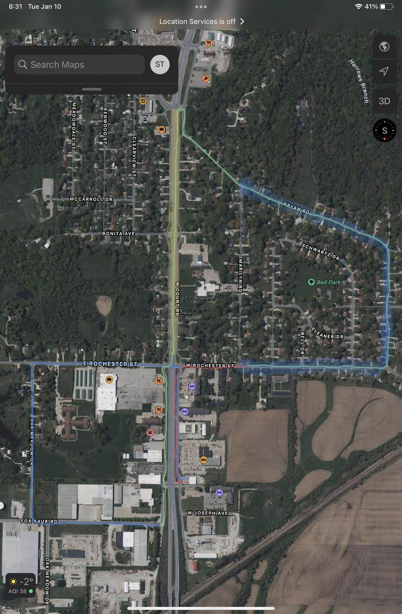
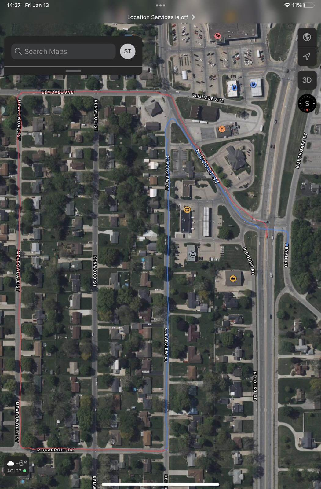
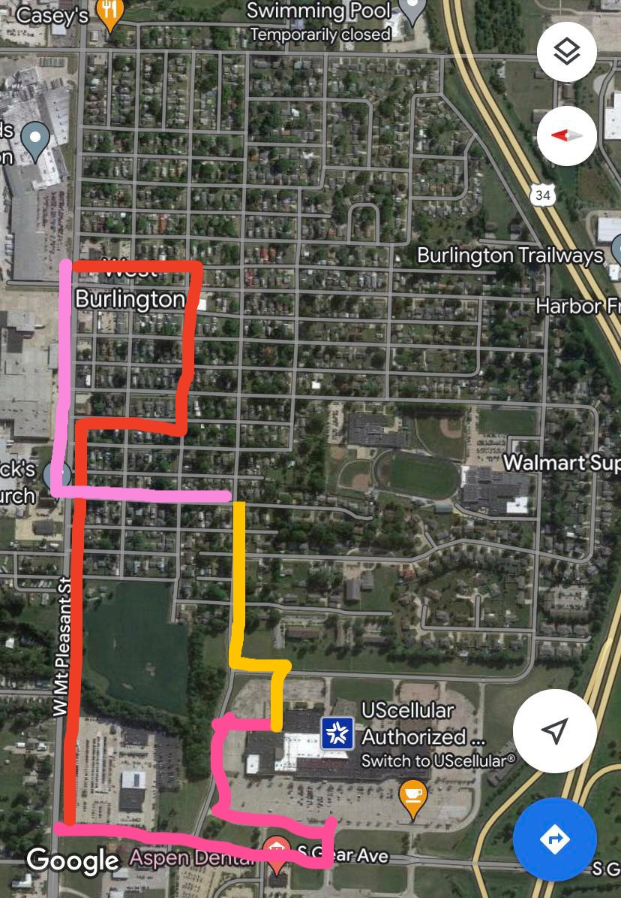

# Driving License

ယာဉ်မောင်းလိုင်စင်အတွက် ၂ဆင့် ဖြေဆိုရမည်ဖြစ်ပြီး knowledge test and driven test ဟူ၍ ရှိသည်။

Knowledge test အတွက် လိုအပ်ချက်များမှာ
- I20
- [I94](https://i94.cbp.dhs.gov/I94/#/recent-search)
- Passport
- မိမိတင်ပြသော လိပ်စာတွင် နေထိုင်ကြောင်း သက်သေ(ကျောင်းမှ housing@miu.edu email ကို တောင်းနိုင်သည် သို့မဟုတ် ဘဏ်မှ agreement form ကို ယူဆောင် သွားနိုင်သည်)

အောင်လျှင် $6 ပေးသွင်းရမည်။

# Knowledge test appointment ယူရန် 

[https://www.picktime.com/JeffersonCountyDL](https://www.picktime.com/JeffersonCountyDL)

သို့မဟုတ်

[Sigourney](https://www.google.com/maps/place/Keokuk+Motor+Vehicle+Department/@41.3333362,-92.2051183,166m/data=!3m1!1e3!4m6!3m5!1s0x87e5e149c047a80d:0x8afffc90233bee42!8m2!3d41.3332432!4d-92.2045644!16s%2Fg%2F1tcwrpr5) သိို့ သွားပြီး ဖြေနိုင်သည်။ ၁ နာရီ မှ ၄ နာရီ အတွင်း appointment မယူပဲ သွားကာ ဖြေနိုင်သည်။

## Knowledge test sample လေ့ကျင့်ရန် 

[https://iowadot.gov/mvd/driverslicense/iadrivertest_desktop.aspx](https://iowadot.gov/mvd/driverslicense/iadrivertest_desktop.aspx)

## Driving test အတွက် လိုအပ်ချက်များမှာ

Behind the wheel / Driving test အတွက် လိုအပ်ချက်များမှာ

- SSN number (ကျောင်းမှ လျှောက်ပေးမည်)
- I20
- I94
- မိမိတင်ပြသော လိပ်စာတွင် နေထိုင်ကြောင်း သက်သေ(ကျောင်းမှ housing@miu.edu email ကို တောင်းနိုင်သည် သို့မဟုတ် ဘဏ်မှ agreement form ကို ယူဆောင် သွားနိုင်သည်)
- Passport
- ကား , The vehicle must pass an inspection. Your vehicle must have the following working headlights, brake lights & turn signals, horn, tires, exhaust (no leaks) and mirrors, front driver and passenger windows must roll down, the windows/windshield must permit clear vision (no cracks the impede your or the Drive Examiner’s line of sight or that intersect with another crack) and no spiderweb cracks in the windshield area that is swept by the windshield wipers, license plate on front and back of the vehicle, and both driver and passenger doors must be able to open from the interior.
- ကားနှင့်အတူ insurance ပေးသွင်းထားသော စာရွက်စာတမ်း

အောင်လျှင် $8 ပေးသွင်းရမည်။

## Appointment

[Appointment](https://smsqmatic.iowadot.gov/qmaticwebbooking/index.html) ယူရာတွင် ၂မျိုးရှိပြီး ပေးထားသော link မှာ ကျောင်းနှင့်အနီးရှိ မြို့များတွင် appointment booking တင်ရန်ဖြစ်ပါသည်။ 

ကျောင်းနားရှိ Jefferson County တွင် appointment ယူမည်ဆိုပါက လတိုင်း၏ နောက်ဆုံးအပတ် တနင်္လာနေ့တွင် Knowledge test ဖြေခဲ့သော နေရာတွင် လူကိုယ်တိုင် သွားရောက် ယူရမည် ဖြစ်သည် (သို့မဟုတ်) ဖုန်းဆက်ကာ ယူနိုင်သည်။ (လူများသည့်အတွက်ကြောင့် မနက် ၃/၄နာရီ သွားစောင့်ကြသည်၊ winter break, summer break များတွင်တော့ သက်တောင့်သက်သာ ရနိုင်သည်)။

641 472 2349 / 51 W. Briggs Ave
Knowledge test အောင်မြင်ပြီး ကဒ်ရရှိမှ Driving test အတွက် appointment ယူနိုင်သည်၊ စာရွက်နှင့် appointment ယူ၍ မရပါ။

Driving test ဖြေဆိုပြီး ကျလျှင် ၂ပတ်တာ စောင့်ဆိုင်းပြီးမှသာ appointment ပြန် ယူနိုင်သည်။

## Route

### Fairfield

### Otumwa

### Burlington

