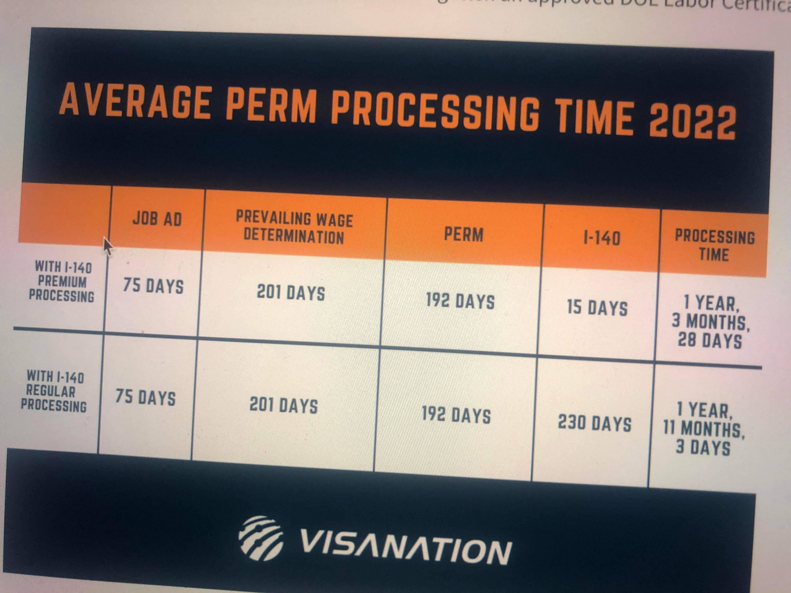

# [Sponsor](https://www.immi-usa.com/perm/)

ဤ စာမျက်နှာသို့ ရောက်ရှိလာလျှင် သင်သည် မြတ်နိုး၊ ကာရံ၊ သဇင်၊ ဘေဘီတို့ထက် ပို၍ စပွန်ဆာကို လိုချင်တောင့်တ နေပြီဖြစ်သည့်အတွက် သင့်အစား ကျွန်တော်တို့မှ ဂုဏ်ယူ ၀မ်းမြောက်ကြောင်း ဦးစွာ ပထမ ပြောကြားလိုပါသည်။ နိုင်ငံတိုင်းမှ လူတိုင်းသည် အလုပ်ရှိ ရှူးဂါး ဒယ်ဒီ၊ ရှူးဂါး မာမီတို့ထံမှ စပွန်ဆာကို လိုချင်ကြသော်ငြား စပွန်ဆာသည် လှည်းတန်း ဦးထွန်းလမ်းခြံလမ်း ထိပ်ရှိ ကြော်ငြာ လက်ကမ်းစာရွက်ကဲ့သို့ သို့မဟုတ် လစဥ်လတိုင်း ရောက်လာတတ်သော မီတာဘေလ်စာရွက်ကဲ့သို့ ရယူဖို့ရန် လွယ်ကူနေသော ကိစ္စ မဟုတ်ပါချေ။

## ၂၀၂၂ အတွက် ပျှမ်းမျှကြာချိန်ပြ ပုံ

အထက် ဖော်ပြပါ ပုံသည် ထိပ်တန်း လျှို့၀ှက်ချက်ဖြစ်ပြီး အလွန်မတရာမှ ထူးချွန် ထက်မြက်လှသော စုံထောက်ဖြစ်သူ ဆားပုလင်း ၀ိုင်းထင်ဟ ထံမှ ရရှိထားခြင်း ဖြစ်ပါသည်။ စပ်စုကြည့်ရှူမိသူ သင့်အနေဖြင့်လည်း အထူး လျှို့၀ှက်ထားပေးပါရန် အကျွန်ုပ်တို့မှ အနူးအညွတ် တောင်းဆိုအပ်ပါသည်။

## အဆင့်များ

### ပထမအဆင့်

ပထမ အဆင့်အနေဖြင့် စပွန်ဆာပေးမည့် ကိုကို မမ(အလုပ်ရှင်) မှ သူ စပွန်ဆာပေးမည့် အလုပ်အတွက် အလုပ်ခေါ်စာ(job advertisement) တင်ပေးရပါလိမ့်မည်။ အလုပ်ခေါ်စာကို indeed၊ ziprecruiter၊ သတင်းစာ အစရှိသည်တို့တွင် ထည့်သွင်း ကြေညာပြီးနောက် ၇၅ရက်ခန့်အကြာတွင် DOL(အလုပ်သမားရေးရာ၀န်ကြီးဌာန)သို့ တင်ပြကာ ဆုံးဖြတ်ချက် ခံယူရမည်ဖြစ်သည်။

### ဒုတိယအဆင့်

ဒုတိယ အဆင့်အနေဖြင့် DOL(အလုပ်သမားရေးရာ၀န်ကြီးဌာန) သို့ တင်ပြကာ ဆုံးဖြတ်ချက် ခံယူခြင်းကို PWD ဟု ခေါ်သည်။ မည်သည့် အချက်အလက်တို့ကို တင်ပြရမည်လဲဟု မေးလျှင် ခေါ်ထားသော အလုပ်အတွက် လာရောက် လျှောက်ထားသူ မရှိပါကြောင်း၊​ လာရောက် လျှောက်ထားသူများ ရှိလျှင်လည်း မည်သည့်အကြောင်းပြချက်များကြောင့် ထို လျှောက်ထားသူများကို ငြင်းပယ်ရပါကြောင်း စသည့် အကြောင်းပြချက်များ ပါ၀င်သည့် recruitment report ဖြစ်သည်။ ထို့အပြင် နိုင်ငံသား လုပ်သား ရှာမရသည့်အတွက် နိုင်ငံခြားသား တစ်ဦးဦးက လာလျှောက်လျှင် မည်ရွေ့မည်မျှ လစာဖြင့် စပွန်ဆာ ပေးလိုပါကြောင်းကို DOL ထံမှ ခွင့်ပြုချက် တောင်းခံရလိမ့်မည်။ နိုင်ငံခြားသားတိုင်း အလုပ်လျှောက်၍ ရသော်လည်း ထိုနိုင်ငံခြားသားများထဲမှ ကိုဘယ်သူ၊ မဘယ်၀ါကို စပွန်ဆာ ပေးချင်ပါကြောင်းကိုလည်း ထပ်မံ၍ ခွင့်ပြုချက် တောင်းခံရမည် ဖြစ်သည်။

### တတိယအဆင့်

တတိယ အဆင့်တွင် DOL ထံမှ ခွင့်ပြုချက်နှင့်အတူ PERM process စတင်မည် ဖြစ်သည်။ ကိုဘယ်သူ၊ မဘယ်၀ါ၏ အချက်အလက်၊ စာရွက်စာတမ်း၊ သမိုင်းကြောင်း အစရှိသည်တို့ကို တင်သွင်းရလိမ့်မည်။ PERM အောင်လျှင်ကာမှ အောင်သည့် certificate လေးကို လက်ခံရရှိလိမ့်မည် ဖြစ်သည်။

### စတုတ္ထအဆင့်

စတုတ္ထ အဆင့်တွင် I-140 အဆင့်ကို ရောက်မည်ဖြစ်ပြီး ယူအက်စ်စီအိုင်အက်စ်ကို အချက်အလက်များ တင်ပြရမည်။ ထို့အပြင် status ပြုပြင်ခြင်း၊ အီးအေဒီ လျှောက်ထားခြင်း စသည်တို့ကိုပါ တစ်လက်စတည်း တွဲကာ တင်နိုင်လိမ့်မည်။

စတုတ္ထအဆင့် ပြီးဆုံးလျှင်ဖြင့် သင်အနေနှင့် ဆေးစစ်ခြင်း၊ ဓာတ်ပုံအရိုက်ခံခြင်း၊ အင်တာဗျူးဖြေခြင်း စသည်တို့သာ ကျန်ရှိတော့မည်ဖြစ်ပြီး စပွန်ဆာ(တကယ်) ရရှိခါနီးဖြစ်နေပြီဆိုတာကို ပြောနိုင်ပြီ ဖြစ်သည်။

### Disclaimer

အထက် ဖော်ပြပါ အချက်အလက်များသည် အကြမ်းဖျင်း ရေးသားထားတာဖြစ်ပြီး လိုအပ်ချက်များ၊ လွဲချော်မှုများ ပါရှိနိုင်သည့်အတွက် နားလည်ပေးရန် လိုအပ်ပါလိမ့်မည်။ ဆားပုလင်း ၀ိုင်းထင်ဟ နှင့် ကျွန်ုပ်တို့မှ sharing သာ ပေးပြီး စပွန်ဆာ မပေးကြောင်းကိုလည်း အသိပေးလိုပါသည်။
